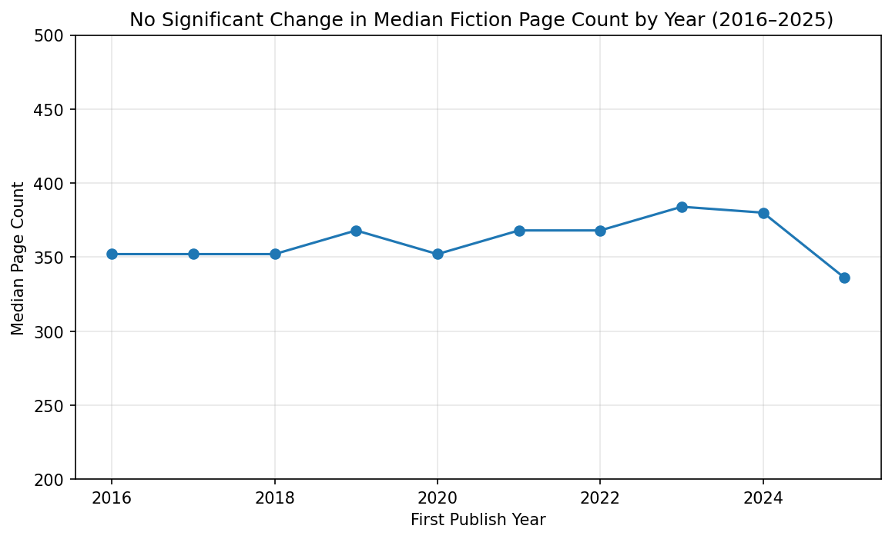

# ME204 Final Project

- [annikakrause1505](./annikakrause1505.md)
# Have Fiction Books Gotten Longer? A 10 Year Look (2016–2025)

# The Question: 
## Have fiction books been increasing in page length over the last 10 years?

## As reading rises in popularity, the demand for fiction novels has skyrocketed. I want to determine if authors have started to increase the length of their work to accomadate those demands.

# Finding 1:
## Looking at median page count year by year, the line shows no significant movement. A linear regression across the decade shows a slope of just 1.4 pages per year, with an R² of 0.08 and a p-value of 0.43, far from statistically significant. The data does not support the idea that fiction books have gotten meaningfully longer over this period.

# Finding 2: 
## If we split the decade into two halves and compare them seperatley, we see different results. Median page count rose from 352 pages (2016–2020) to 368 pages (2021–2025). That is a sixteen page increase that is highly statistically significant with a Mann-Whitney value of p = 0.0009. This suggests fiction books did get longer over the decade, but the change happened as more of a shift between periods than a steady climb.

# Limitations 
## This analysis is based on a stratified sample of 500 fiction works per year, drawn from Open Library's archive. About 20% of records were missing page count data and were excluded. A page count ceiling of 900 pages was applied to remove metadata errors and misclassified boxed series. I found the hard limit to be the most effective way of filtering out these misclassifications after looking at large chunks of the data and finding the most accurate page count to limit it at. I tried filtering out titles with key words like 'series' and 'collection' but because there are so many possible words used in place of series and the fact that many actual novels use those words in their title, this method proved ineffective. 

# Data
## My full data collection, cleaning, and analysis notebooks are in this repository under NB01, NB02, and NB03.
